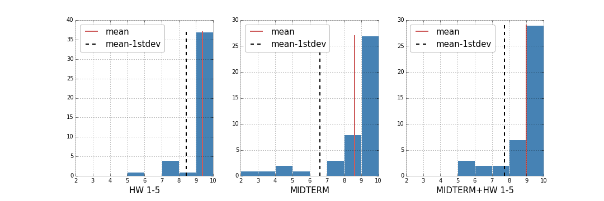

*it only seemed fair...*

## Clarity
It's apparent that these are histograms, but without any title the y-axes might be a little confusing without any labels (e.g., 'counts' or 'frequency') of their own. 

## Aesthetic
'1stdev' takes a bit of effort to parse. If the size of the legend entries were a little smaller, there would be room for additional spaces.

## Honesty
Most of the populations are in the last bins (9-10). There might be more insight if the bins were recentered on the whole values (edges on the half-values) or if there were additional bins.
